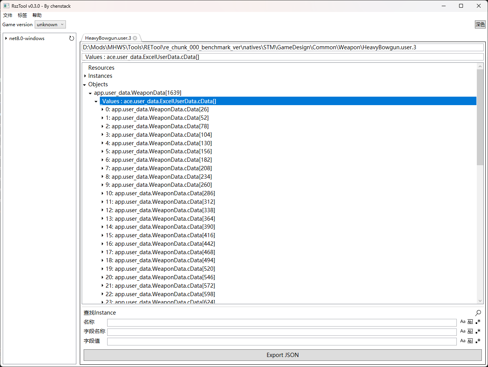

>[!IMPORTANT]
>
>Forked from [https://github.com/czastack/RszTool](https://github.com/czastack/RszTool)
>
>**Only support Monster Hunter: Wilds**

 

# How to use this tool

- Download the latest release [here](https://github.com/dzxrly/RszTool-MHWS/releases).
- Select **Game Version** to **unknown**.
- You can Click File/Open menu or drag and drop file to RszTool.App window to open it.
- Right click for array item/game object to see some operation context menu. I think it is good to use.

